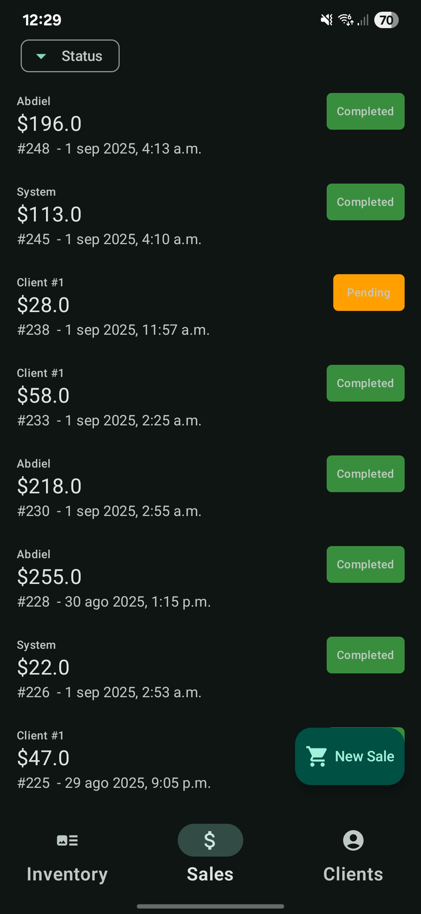
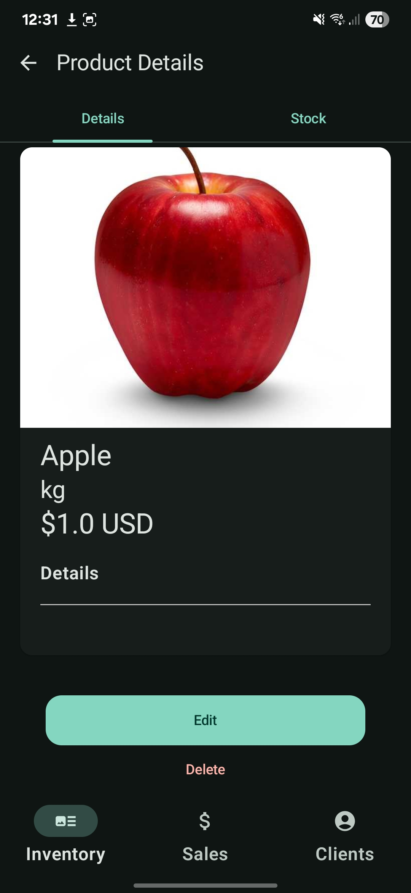
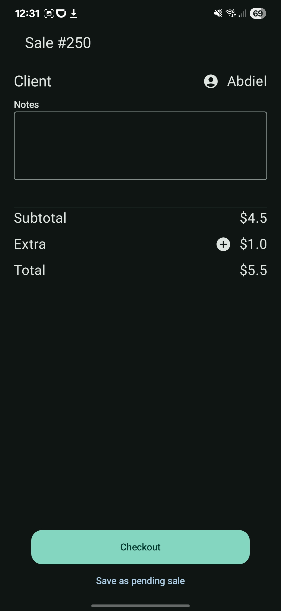

# PuntroSales-Demo
Offline Point of Sales for Android

We’re excited to invite you to test our new app Puntro Sales! 🚀

- You can download the app directly from the Google Play Store:
👉 https://play.google.com/store/apps/details?id=com.imecatro.demosales

- Or,join our closed testing group here:
👉 https://groups.google.com/g/puntro-sales-demo

- Once you’ve joined the group, you’ll see the link to download the app directly from the Google Play Store.

## Screenshots

* Normal phone (Portrait)

  
  
  

### Features

- CRUD for products
  - Products has an inventory
- CRUD for Sales
  - Sales are automatically synchronized with clients and inventory 
- CRUD for clients
  - The idea, is to control clients sales history

- [x] Create a new product
  - Image from device gallery or camera
  - Name
  - Price
  - Category
  - Initial stock
  - Unit (pcs, mL, kg, lb)

- [x] Edit product details
- [x] Delete a product and its stock history
- [x] List all products
- [x] Filter and sort products --> Still in progress
- [x] Default product sorting

- [x] Product search bar
- [ ] Download product inventory as CSV

#### Stock Control
- [x] Adjust stock (in/out) by quantity
- [x] Total remaining stock
- [x] Stock syncs with sales; when a sale is completed, items are automatically deducted
- [x] Stock may go negative for pending orders to forecast restocking needs
- [ ] Download stock by product as CSV

### Sales
- [x] List all tickets
- [x] Create a new ticket — stock is automatically deducted
- [x] Cancel a ticket — stock will be re-added
- [x] View ticket details and share a screenshot with overscroll
- [x] Filter sales by date range, status, etc. --> Still in progress
- [x] Download sales as CSV
- [ ] Sales charts and income tracking — *Future*

### Clients
- [x] List all clients
- [x] Add client
- [ ] Sync phone contacts
- [x] Edit client
- [x] Delete client
- [ ] Client sales history

### Home & Settings 
- [ ] Add/Update Store Logo and name, address, phone number
- [ ] Change Currency
- [ ] Change Language
- [ ] Export data (sales, products, clients)) as .zip

## UI Layer

### Libraries

- Hilt for dependency injection
- Compose
- Material 3
- Coil for images

Need permissions : N/A

## Domain layer

It contains all use cases the app needs

### Libraries

- KotlinX coroutines

## Data Source layer
Room Database Instance, it wraps DAOs and migrations

## Libraries

- Room Database
- Hilt for dependency injection