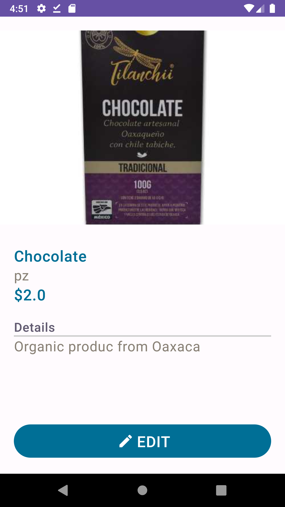

# PuntroSales-Demo
Offline Point of Sales for Android

This file must include
- A brief overview of the app, including its main features and functionality
- A list of the technologies and libraries used to build the app, such as Kotlin, Android SDK, and any third-party libraries
- A description of my role in the development of the app, including any specific responsibilities or contributions
- Screenshots or demo videos of the app in action to give people a sense of how it looks and works
- Any relevant information about the app's performance, such as its stability, scalability, or user feedback
- A link to the app's documentation or user manual, if available
- A call to action encouraging people to try out the app and contact me if they have any questions or feedback.

## Branching Strategy

### Main branches

- master

Naming Conventions
Generally, we can follow next structured pattern

<feature|bugfix>/<package|layer>/<description>

## Screenshots

* Normal phone (Portrait)

  

### Features

- CRUD for products
  - Products has an inventory
- CRUD for Sales
  - Sales are automatically shyncronized with clients and inventory 
- CRUD for clients
  - The idea, is to control clients sales history

[x] Create a new product
- Image from device gallery
- Name
- Price
- Currency (MXN, USD)
- Initial stock
- Unit (pcs, mL, kg, lb)

[x] Edit product details
[x] Delete a product and its stock history
[x] List all products
- [ ] Filter and sort products
- [x] Default product sorting

[x] Product search bar
[ ] Download product inventory as CSV

#### Stock Control
[x] Adjust stock (in/out) by quantity
[x] Total remaining stock
[x] Stock syncs with sales; when a sale is completed, items are automatically deducted
[x] Stock may go negative for pending orders to forecast restocking needs
[ ] Download stock by product as CSV

### Sales
[x] List all tickets
[x] Create a new ticket — stock is automatically deducted
[x] Cancel a ticket — stock will be re-added
[ ] View ticket details and share a screenshot with overscroll
[ ] Filter sales by date range, status, etc.
[ ] Download sales as CSV
[ ] Sales charts and income tracking — *Future*

### Clients
[x] List all clients
[x] Add client
[ ] Sync phone contacts
[x] Edit client
[x] Delete client
[ ] Client sales history

## UI Layer

### Libraries

- Hilt for dependency injection
- Compose
- Material 3
- Coil for images

Need permissions : N/A

## Domain layer

It contains all use cases the app needs

### Libraries

- KotlinX coroutines

## Data Source layer
Room Database Instance, it wraps DAOs and migrations

## Libraries

- Room Database
- Hilt for dependency injection