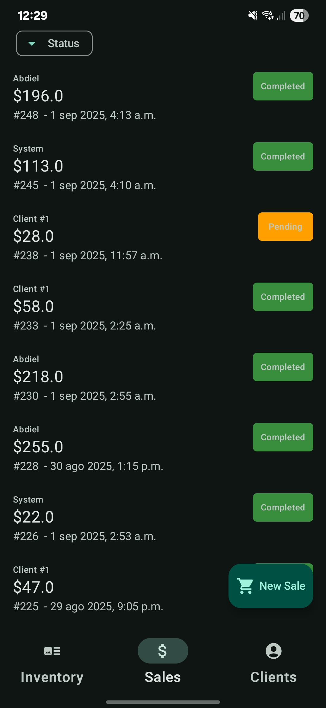
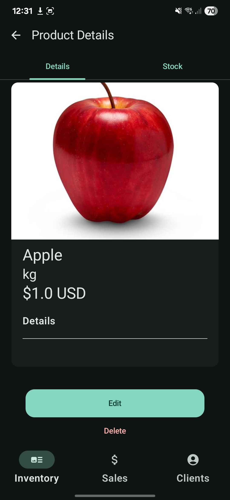
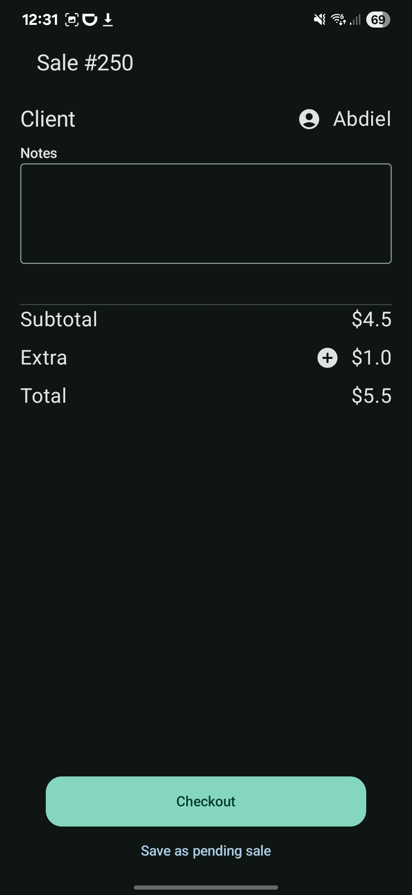
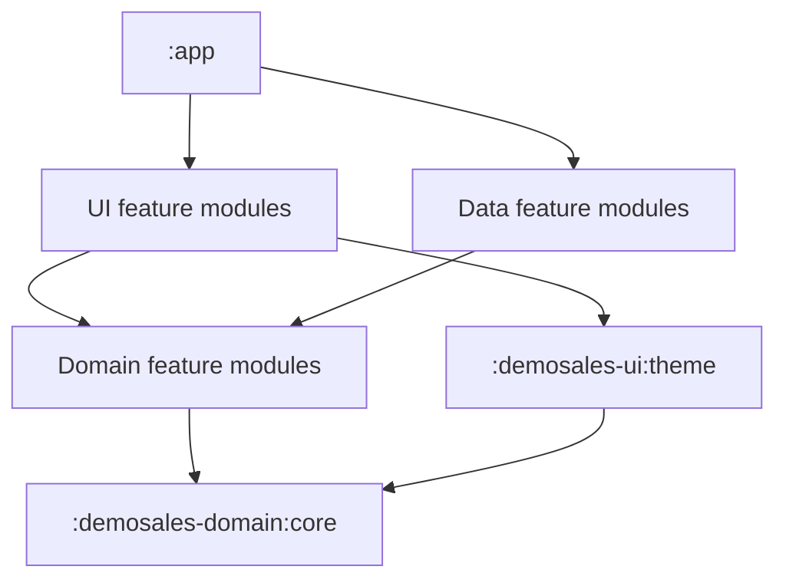

# Puntro Sales

An Android point-of-sale app for managing products, inventory, sales, customers, and purchasing needs. Core sales and inventory workflows use local storage; publishing a web catalog requires an internet connection and authentication.

[Google Play](https://play.google.com/store/apps/details?id=com.imecatro.demosales) · [Testing community](https://groups.google.com/g/puntro-sales-demo) · [Project reports](https://apps.imecatro.com/puntrosales/)

## Feature status

Checked items are implemented. Remaining work is listed under [Pending features](#pending-features).

### Fulfillment plan — Plan de surtido

Turn pending orders into a purchasing list. Open **Sales → the highlighted clipboard button in the top bar** to see the plan for all pending orders, independently of the sales list filters.

- [x] Consolidate product demand across pending orders.
- [x] Show available inventory and the missing quantity for each product.
- [x] Keep demand totals separate by unit, including fractional quantities.
- [x] Switch between all requested products and products to buy.
- [x] Expand a product to see related orders, customer names, and quantities; open an order from the plan.
- [x] Share a text shopping list containing only missing quantities, without customer information.
- [x] Update the plan when orders or inventory change, with manual refresh and retry.
- [x] Show empty and fully covered states, and block sharing when inventory or unit information is missing.

**Inventory calculation:** pending orders already deduct stock when saved. The plan adds their demand back to the recorded balance to calculate availability, then determines the shortage without counting that demand twice. Draft, cancelled, and completed orders are excluded. Viewing or sharing the plan does not change inventory.

### Products and categories

- [x] Create, view, edit, and delete products.
- [x] Set product images, names, prices, units, initial stock, descriptions, categories, and barcodes.
- [x] Search products by name.
- [x] Filter by category, including uncategorized products.
- [x] Sort by name, price, stock, or creation order in either direction.
- [x] Create, rename, and delete categories.
- [x] Select products and export their inventory as CSV.

### Inventory

- [x] Add or remove stock by quantity.
- [x] View current stock and movement history for each product.
- [x] Deduct stock when a sale is saved as pending or completed; drafts do not deduct stock.
- [x] Restore deducted stock when a sale is cancelled.
- [x] Allow negative balances to represent shortages.
- [x] Export a product's stock history as CSV.

### Sales and reports

- [x] Create sales, save drafts, and resume checkout.
- [x] Save pending sales or mark them as completed.
- [x] Assign customers, add notes, and apply discounts or extra charges.
- [x] Find products by name or barcode while building a sale.
- [x] Duplicate existing sales and cancel tickets.
- [x] List sales, search by ticket ID, and filter by status.
- [x] View ticket details and share the full ticket as an image.
- [x] Select tickets and export sales reports or consolidated product quantities as CSV.
- [x] View today's completed-sales total.
- [x] View daily, weekly, and monthly completed-sales charts with total, average, and peak amounts.

### Customers

- [x] Create, list, search, edit, and delete customers.
- [x] Import all or selected phone contacts and update matching customer records.
- [x] View customer purchase history.
- [x] Record completed purchases and reflect cancellations in customer history.

### Web catalog

- [x] Sign in with Google for catalog publishing.
- [x] Select products and configure store information for a catalog.
- [x] Publish and preview a web catalog.
- [x] Open, copy, and share the public catalog link.
- [x] Display and share a catalog QR code.
- [x] View publication status and product, category, and image counts.
- [x] Unpublish a catalog.

### Store profile and preferences

- [x] Update the store logo, name, description, location, and WhatsApp number.
- [x] Choose the store currency.
- [x] Switch the app language between English and Spanish.
- [x] Switch between light and dark themes.
- [x] Persist profile information and preferences locally.

### Pending features

- [ ] Filter the sales list by date or a custom date range. Status filtering and chart period selection are already implemented.
- [ ] Export a complete backup of sales, products, and customers as a ZIP file.
- [ ] Connect catalog visit counts to real analytics; the current count uses placeholder data.

## Screenshots

Sales list, product details, and checkout on a phone in portrait orientation:

  
  
  

### Creating a product

  

## Architecture

The project is organized by layer and feature. Dependencies point toward the domain: **UI → Domain ← Data**. The app module connects the layers and owns navigation and dependency injection.

```mermaid
flowchart TB
    app[":app"] --> ui["UI feature modules"]
    app --> data["Data feature modules"]
    ui --> domain["Domain feature modules"]
    data --> domain
    ui --> theme[":demosales-ui:theme"]
    domain --> core[":demosales-domain:core"]
    theme --> core
```

| Module | Responsibility |
| --- | --- |
| `:app` | App entry point, navigation, dependency wiring, profile settings, and Firebase integrations. |
| `:demosales-ui:products` | Product screens, categories, inventory, and catalog publishing. |
| `:demosales-ui:sales` | Sales, checkout, reports, and the fulfillment plan. |
| `:demosales-ui:clients` | Customer management, contact import, and purchase history. |
| `:demosales-ui:theme` | Shared theme, UI components, and presentation utilities. |
| `:demosales-domain:products`, `:demosales-domain:sales`, `:demosales-domain:clients` | Domain models, repository contracts, and use cases. |
| `:demosales-domain:core` | Shared domain contracts, profile models, and coroutine utilities. |
| `:demosales-data:products`, `:demosales-data:sales`, `:demosales-data:clients` | Repository implementations and persistence. |

The UI uses **Jetpack Compose and Material 3**, dependency injection uses **Dagger/Hilt**, and local database persistence uses **Room**. Domain modules use Kotlin/JVM and coroutines. The fulfillment plan reuses existing domain use cases, with its presentation and aggregation in `:demosales-ui:sales`.

## Project reports

[Browse code quality, API documentation, and test coverage reports](https://apps.imecatro.com/puntrosales/).
